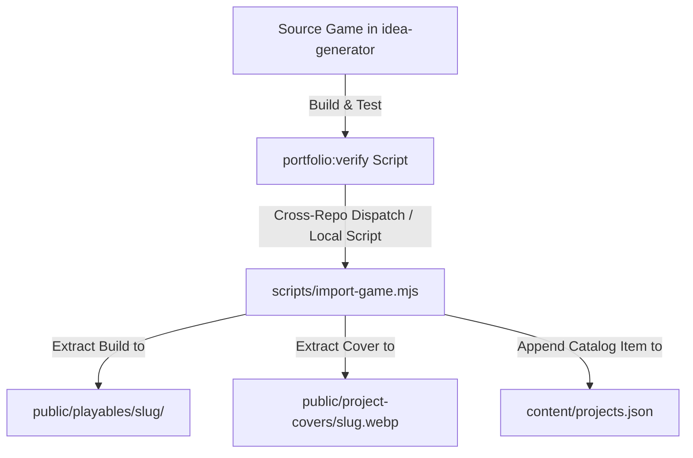

# Personal Portfolio Website & Casual Web Games Catalog

This is a Next.js project containing Fatih Toker's personal website and portfolio. It hosts an integrated catalog of showcases and playable casual web games.

## Architecture & Catalog Workflow

Web games are developed as separate, decoupled projects inside a dedicated source repository (`idea-generator`) and published/imported into this portfolio website.



### Important Curation Rules
*   **Never directly modify or commit game source code** into this repository. All playable files under `public/playables/` must be generated by the automated import script from the upstream source builds.
*   **Locked Sort Order**: The homepage projects section uses a hardcoded curation structure in [projects.json](file:///Users/EZ30JL/Code/personal/personal-website-next/content/projects.json). If you add a new game, configure `sortOrder` and `featured` status accordingly.

---

## Local Setup & Development

### 1. Installation
Install project dependencies:
```bash
npm install
```

### 2. Development Server
Run the local Next.js dev server:
```bash
npm run dev
```
Open [http://localhost:3000](http://localhost:3000) to view the site.

### 3. Verification & Validation
Run linting, schema validation, and E2E tests:
```bash
npm run lint                 # Code style check
npm run validate:projects    # Manifest validation
npm run test:e2e             # Playwright browser automation
```

---

## How to Import a New Game

To import a new casual web game, run the local importer script from the root of this project:

```bash
node scripts/import-game.mjs \
  --source "/path/to/idea-generator/games/your-game" \
  --source-repository "https://github.com/fatihtoker/idea-generator" \
  --source-commit "full-40-char-git-commit-sha-hash" \
  --target-root .
```

### Argument Reference
*   `--source`: Absolute path to the source game directory (which must contain a built `dist/` subfolder, `portfolio.json`, and `portfolio-cover.webp`).
*   `--source-repository`: Upstream git repository URL.
*   `--source-commit`: Full 40-character git commit SHA of the game build source.
*   `--target-root`: Path to this website repository root (typically `.`).

---

## Automated GitHub Actions Publishing

The project supports automated, cross-repository publishing via GitHub Actions:
1.  A workflow dispatch is triggered in `idea-generator` pointing to this repository.
2.  The workflow checkouts a temporary branch (e.g., `automation/import-<slug>`), runs the importer, commits the change, and opens a Pull Request against `main`.
3.  Vercel generates a preview URL for the PR, and a target workflow comments the staging link on the PR.
4.  Once verified, the operator reviews and merges the PR into `main` for production release.

### Required GitHub Secrets
*   **`PERSONAL_WEBSITE_AUTOMATION_TOKEN`**: A fine-grained GitHub Personal Access Token configured in the source repository (`idea-generator`) with write permissions for contents and pull requests restricted to `fatihtoker/personal-website-next`.

---

## Security & Privacy Policies
> [!IMPORTANT]
> When installing packages or running builds locally, the host machine's npm client may fall back to internal corporate registries (e.g. `artifactory.insim.biz`).
>
> **Always verify that `package-lock.json` does not contain corporate registry references before committing changes.**
> You can scan and verify the lockfile URLs by running:
> ```bash
> grep -r "resolved" package-lock.json | grep -v "registry.npmjs.org"
> ```
